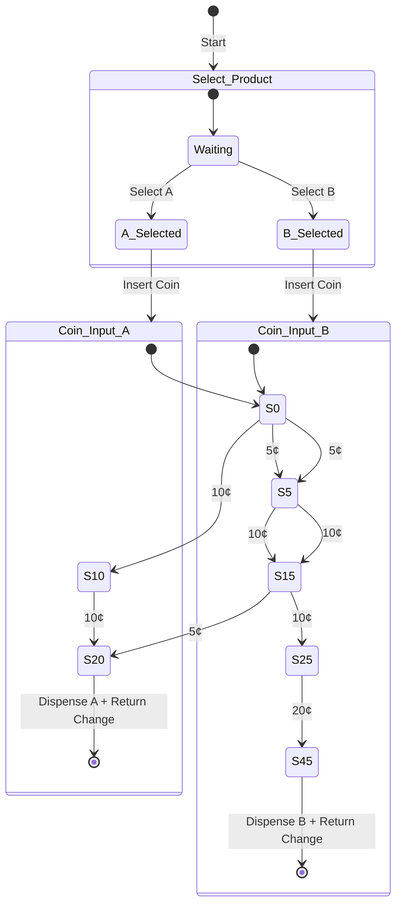
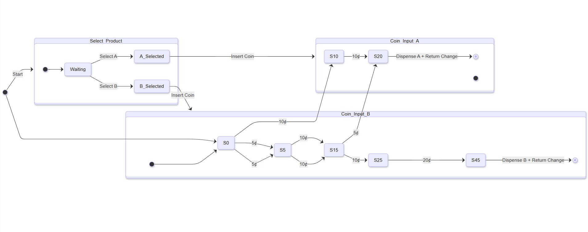
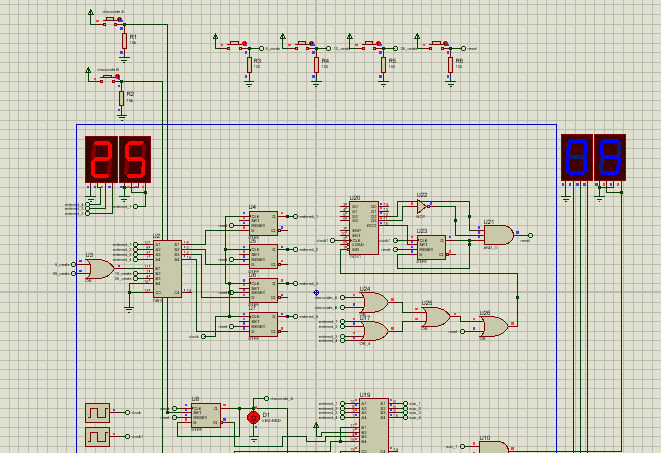
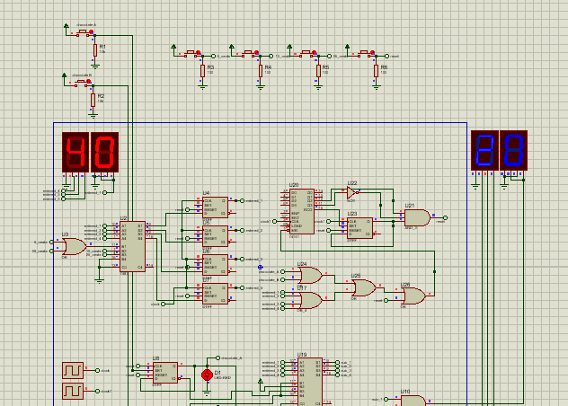
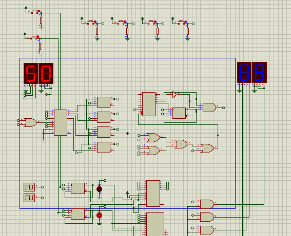
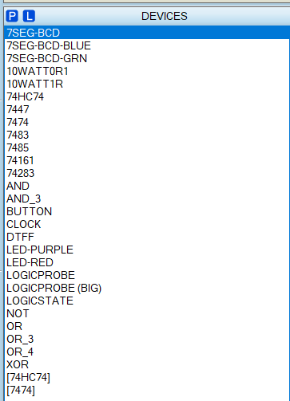
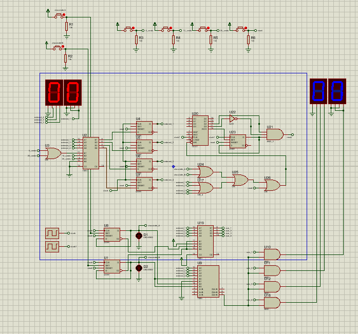

# Digital Systems 1 – Vending Machine (Final Project)

A Mealy FSM–based vending machine that sells two chocolate products (20¢ and 45¢).  
The machine accepts 5¢, 10¢, and 25¢ coins, shows the running total on dual seven-segment displays, vends the selected product, and returns change.

> Course: Digital Systems 1 • Platform: Proteus simulation

---

## ✨ Features
- Two products: **Chocolate A = 20¢**, **Chocolate B = 45¢**
- Accepted coins: **5¢, 10¢, 25¢**
- **Mealy** finite state machine implementation
- **Dual 7-segment** display for the inserted amount
- **Change return** after vend
- **The red seven-segment** display shows the total amount of money inserted, while **the blue seven-segment** display shows the amount of change returned.
- Fully **simulated in Proteus**

---

## 🗂️ Repository Structure
```
.
├── docs/
│   ├── DigitalSystems1_Project_2023.pdf
│   └── Project_Report_FA.pdf
├── images/
│   ├── state_diagram.jpg
│   ├── scenario1.png
│   ├── scenario2.png
│   ├── scenario3.png
│   ├── full_circuit.png
│   └── components_panel.png
├── proteus/
│   └── vending_machine.pdsprj
└── README.md
```

---

## 🧩 State Machine (Mermaid)
> GitHub renders Mermaid diagrams natively.  
> This is a clean overview of selection + coin input for A (20¢) and B (45¢).



If you prefer a static image, see:  


---

## 🧪 Simulation Scenarios (Proteus)
- **Scenario 1** – Select A (20¢): insert **5¢ + 10¢ + 10¢**  
  

- **Scenario 2** – Select A (20¢): insert **5¢ + 5¢ + 5¢ + 25¢** (tests change return path)  
  

- **Scenario 3** – Select B (45¢): insert **25¢ + 25¢**  
  

---

## 🔌 Components & Connections (Proteus)



**Core parts used**
- **7SEG-BCD (Red/Blue)**: dual 7-segment displays for showing the running total (BCD input → display driver → segments).  
- **Logic gates (AND, OR, XOR, NOT)**: combinational logic to compute next-state and outputs from `(state, coin, selection)`.  
- **74HC74 (D-type Flip-Flops)**: state registers; clocked by system `CLOCK`.  
- **74161 (4-bit counter)**: optional tally/assist for coin accumulation or timing.  
- **7485 (4-bit comparator)**: compares accumulated amount against product price thresholds (20¢/45¢).  
- **Buttons**: simulate coin insertion (**5, 10, 25**).  
- **LEDs (Red/Green/Blue)**: indicators (e.g., vend, change, error/timeout).  
- **CLOCK**: drives synchronous elements (flip-flops/counters).

**High-level wiring**
1. **Inputs**: `SelectA/SelectB`, `Coin5/Coin10/Coin25`, `CLOCK`, `RESET`.  
2. **Coin encoder / adder**: maps coin buttons to a 2-bit/4-bit value and adds to a **running sum** (combinational + optional 74161).  
3. **Comparator (7485)**: checks `sum ≥ 20` (for A) or `sum ≥ 45` (for B).  
4. **FSM (74HC74 + logic)**:  
   - **Next-state logic** uses `(state, coin, selection)` to transition across `S0, S5, S10, S15, S20, S25, S45`.  
   - **Output logic (Mealy)** asserts `VEND_A` or `VEND_B` and generates **change** when thresholds reached.  
5. **7-segment**: BCD from `sum` → **7SEG-BCD** → displays current amount.  
6. **Change & Vend**: drive LEDs/logic outputs; reset `sum` after vend.

**Full circuit view**  


---

## 📋 State Tables

**Chocolate A (20¢)**

| Present | Input (¢) | Next | Output                         |
|--------:|-----------:|-----:|--------------------------------|
| S0      | 5          | S5   | –                              |
| S5      | 10         | S15  | –                              |
| S15     | 5          | S20  | **Dispense A + Return Change** |
| S0      | 10         | S10  | –                              |
| S10     | 10         | S20  | **Dispense A + Return Change** |

**Chocolate B (45¢)**

| Present | Input (¢) | Next | Output                         |
|--------:|-----------:|-----:|--------------------------------|
| S0      | 5          | S5   | –                              |
| S5      | 10         | S15  | –                              |
| S15     | 10         | S25  | –                              |
| S25     | 20         | S45  | **Dispense B + Return Change** |

> Note: Additional transitions (e.g., multiple 25¢ paths, timeouts, and explicit change states) can be added depending on your exact implementation.

---

## ▶️ How to Run
1. Open **Proteus** and load `proteus/vending_machine.pdsprj`.  
2. Use **coin buttons** (5/10/25) to insert coins after selecting **A** or **B**.  
3. Observe the **7-segment displays** and **LED indicators** during scenarios.  
4. Confirm vend and change behavior matches the **state tables** above.

---

## 📚 Documentation
- Problem statement: `docs/DigitalSystems1_Project_2023.pdf`  
- Project report (FA): `docs/Project_Report_FA.pdf`

---

## 🖊️ License
MIT (or your preferred license).
